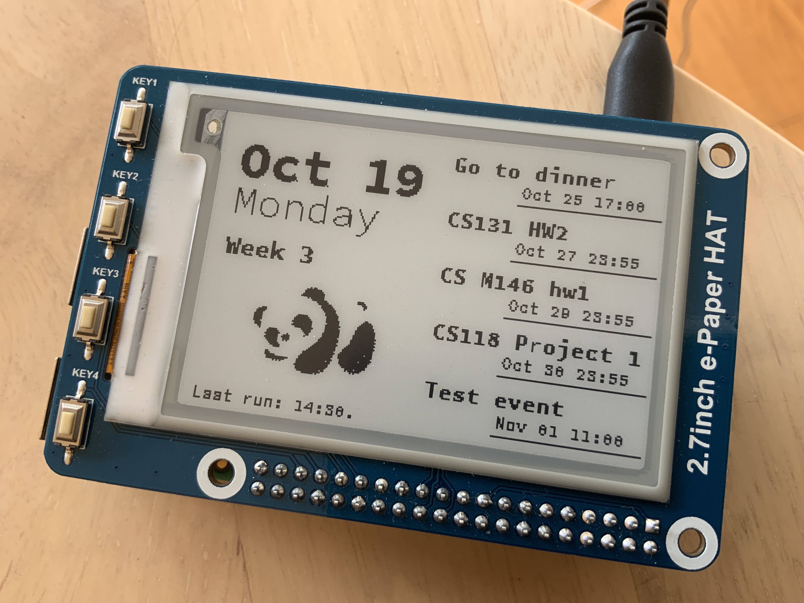

# [Pi Calendar using E-paper display](https://jackzzhao.com/post/pi-calendar-using-e-paper-display/)

This project is a digital calendar implemented with Raspberry Pi and Waveshare's
2.7 inch e-Paper HAT display written in Python. The idea is to bring iCal/Google/iCloud
calendar subscriptions to this tiny desktop device, and presented in a beautiful format.

<br>

**Preview**
<br>


### Requirements

- Raspberry Pi Zero/3/3b/4/4b
- Waveshare 2.7 inch e-Paper HAT display
- Python 3.6+
- Waveshare EPD module \([Portal](https://github.com/waveshare/e-Paper/tree/master/RaspberryPi&JetsonNano/python/lib/waveshare_epd)\)
- PIL library (To generate buffer image)
- icalendar
- requests


First, check update for the raspberry pi:

```
sudo apt-get update
sudo apt-get upgrade
```

After that, install the required libraries, you might want to activate
your virtual environment if needed:

```
pip3 install icalendar
pip3 install Pillow
pip3 install requests
```

### Workflow
1. First, we need to get our calendar share link ready. Go to your calendar setting, and make it public, 
then you could get a share link.

> Note that you probably would get a link with different protocol headers like `webcal://`, replace that with `http://` or `https://`, otherwise the link could not be resolved.

2. Use `requests.get()` method to get the response from your calendar share link above.

3. Now, you are able to parse the response string using the `icalendar` module. 

    ```
    ical = Calendar.from_ical(response.text)
    ```

    Using class method `.walk()`, you would get a list of `dict()`-type events:

    ```
    events = [e for e in ical.walk('vevent')]
    ```

    > Feel free to explore other keywords in `ical` :)

4. *(optional)* Not all datas are necessary, sanitize your data with your own rules.

5. Draw <a href="#buffer">buffer image</a> using the PIL library

6. Render image to the e-Paper display

7. Done!

<a id="buffer"></a>
### About buffer image and render
Similar to a real display render, we need to draw every pixel from top left to bottom right. But this is not a
direct display rendering process, we need to take advantage from PIL library and generate a buffer image with
the exact dimension as the display. The good thing about using PIL is that we do not need to worry about text 
display, as we can simply load the font and draw the text.

Carefully design and put your desired content on this tiny 176 * 264 image!

After generating your buffer image, use the epd library to render your image.

```
epd = epd2in7.EPD()
epd.init() # Initialize display
epd.display(epd.getbuffer(bufffer_image)) # Render now
```

### Ready to Launch
Run the script and you could probably see the image is being refreshed 
on your device. Hopefully everything is working well. Since this model 
of Waveshare's e-Paper display does not support partial refresh yet, so
the refreshing process is kind of slow. Hence, run the script regularly 
with a long interval is suggested.

<h2>The End</h2>
